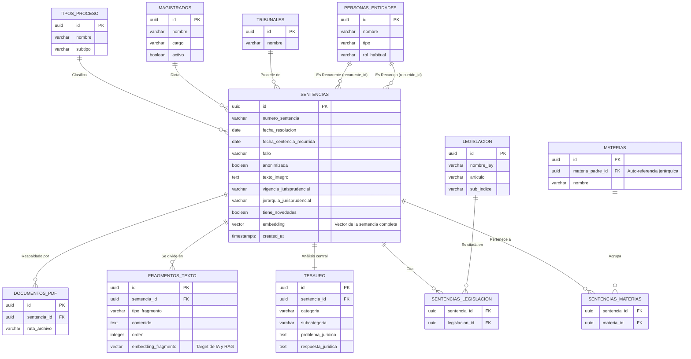

# Arquitectura y Estrategia de Base de Datos para Modelo de IA Legal (Honduras)

Este documento detalla la estrategia de extracción de datos de las sentencias del Sistema Jurisprudencial y la arquitectura recomendada para entrenar o alimentar un modelo de Inteligencia Artificial (IA) con un volumen estimado de **5,000 a 50,000 sentencias**.

---

## 1. Análisis de los Documentos y Estrategia de "Recorte" (Chunking)

Actualmente el sistema de scraping genera dos documentos principales por cada sentencia. Para alimentar un modelo de IA de manera óptima (para que no alucine y sea preciso en derecho), debemos extraer información de ambos de la siguiente manera:

### Documento 1: Miniatura Web (Metadatos Clasificados)
Este PDF (que podemos procesar más fácil porque forzamos su estructura) contiene estructuras llave-valor perfectas para **filtrado duro y metadatos**. Al buscar, la IA primero filtrará por estos campos antes de leer el texto.
**Segmentos a extraer en la BD:**
1. **Identificadores:** `Sentencia` (Ej. CL-407-01).
2. **Clasificación Judicial:** `Tipo de proceso`, `Subtipo de proceso`, `Materia` (Ej. Derecho Laboral), `Motivos`.
3. **Actores Legales:** `Magistrado ponente`, `Recurrente`, `Recurrido`, `Tribunal`.
4. **Línea de Tiempo:** `Fecha de resolución`, `Fecha de sentencia recurrida`.
5. **Resúmenes Clave:** `Fallo` y `Hechos relevantes`.

### Documento 2: TipoCertificadoPDF (Texto Completo Nativo)
Este PDF contiene el razonamiento humano, la jurisprudencia citada y el texto legal bruto dictaminado por los jueces. Este es el corazón de la IA para buscar semánticamente "ideas" y contextos.
**Segmentos a extraer y "cortar" (Chunking):**
1. **Considerandos (Razonamientos Legales):** Extraer los párrafos donde la corte explica *por qué* tomó la decisión, citando leyes o sentencias jurisprudenciales pasadas.
2. **Parte Dispositiva / Por Tanto:** El desenlace y resolución final, desglosado de las formalidades iniciales.
3. *Chunking:* Este documento es muy largo para que una IA lo lea de golpe. La técnica requerida es pasarlo por un algoritmo que divida el texto en "Chunks" o **bloques de ~500 a 1000 tokens** respetando saltos de párrafo, para que la IA sólo recupere el párrafo exacto que necesita responder.

---

## 2. Recomendación de Base de Datos (BD)

Para un volumen de 5,000 a 50,000 documentos orientados a crear una IA "LegalTech", tienes **dos necesidades técnicas completamente opuestas**:
1. Necesitas buscar de forma exacta o filtrar (Ej: *"Fíltrame sólo las sentencias de Materia Penal donde el ponente sea Lidia Estela del año 2001"*).
2. Necesitas buscar de forma "inteligente" o semántica por contexto (Ej: *"Menciona y resume casos hondureños donde un despido indirecto fue justificado por cambio de horario discriminatorio"*).

### La Mejor Opción: PostgreSQL con la extensión `pgvector`

**¿Por qué es la mejor opción técnica (Recomendada)?**
* **Esfuerzo Unificado:** Solucionar esto históricamente requería pagar una base NoSQL (como MongoDB) para el texto Y ADEMÁS pagar una base vectorial militar (como Pinecone) para la IA. Utilizar PostgreSQL unifica ambas cosas en un solo servidor de forma gratuita si se hospeda uno mismo.
* **Escalabilidad Perfecta:** Entre 5 y 50 mil documentos con texto completo y vectores matemáticos es catalogado como "Data Mediana". Todo cabe perfectamente en PostgreSQL y sus métricas de respuesta para IA (K-Nearest Neighbors index) volarán en milisegundos.
* **Filtro + IA (Configuración Híbrida):** Es la base perfecta para el diseño de "RAG" (Retrieval-Augmented Generation). Permite filtrar con un SQL simple por los campos extraídos del Documento 1 (`WHERE materia 'Laboral' AND fecha > 2000`) y *simultáneamente* cruzarlo con una búsqueda de proximidad semántica utilizando los vectores de los párrafos extraídos del Documento 2.

---

## 3. Diagrama de Arquitectura de Extracción e IA

El siguiente diagrama de flujo ilustra la arquitectura integral: cómo pasarán los datos crudos desde el Poder Judicial, atravesando el procesamiento de PDFs, hasta llegar al cerebro de tu modelo asisitiendo abogados.

```mermaid
graph TD
    %% Fuentes de datos extraídas
    A1[Poder Judicial HN] -->|Auto-Scraping| A2(PDF 1: Metadatos)
    A1 -->|Auto-Scraping| A3(PDF 2: TipoCertificado)

    %% Pipeline de Procesamiento Vectorial
    subgraph Pipeline de Ingesta y Limpieza (Python)
    A2 -->|Librería PyMuPDF / Regex| B1[Extracción a Formato JSON Llave-Valor]
    A3 -->|Librería OCR / PyMuPDF| B2[Limpieza de Texto Legal Bruto]
    B2 -->|Algoritmo TextSplitter| B3[Chunking: Dividir en bloques de 500 palabras]
    end

    %% Modelos AI de Integración
    B3 -->|Modelo de Embeddings Ej: text-embedding-ada-002| C1[Se generan Vectores Matemáticos]

    %% Base de datos recomendada (Cerebro Central)
    subgraph Base de Datos: PostgreSQL + pgvector
    B1 -->|Datos Estructurados| D1[(Columnas SQL: Fecha, Materia, Juez)]
    C1 -->|Array de floats 1536-D| D2[(Columna Vectores KNN HD)]
    B3 -->|Párrafos humanos legibles| D3[(Chunks de Texto Plano)]
    end
    
    %% Interacción Final RAG
    D1 -.-> E1
    D2 -.-> E1
    D3 -.-> E1
    
    E1((Abogado/Usuario de IA)) -->|Pregunta Legal Compleja en lenguaje natural| F1[Búsqueda Híbrida: Vectorial + Filtros SQL]
    F1 -->|Devuelve Contextos y Jurisprudencia Relevante local| F2[Modelo LLM: GPT-4o / Claude 3 / Llama 3]
    F2 -->|Genera Respuesta Final sustentada con Citas Exactas| E1
```

---

## 4. Próximos Pasos Técnicos para el Proyecto

Para hacer realidad este modelo inteligente a partir de donde nos encontramos hoy, la ruta recomendada es:

1. **La Recolección:** Dejar que el sistema de Agentes Simultáneos en NodeJS (actualmente corriendo) finalice de descargar las 50,000 sentencias al servidor local `D:\Sentencias`.
2. **El Parser (Extractor):** Como paso siguiente, crearemos un pequeño programa en Python que barrerá esa carpeta `D:\Sentencias`. Usará librerías lectoras de PDF para leer todos esos documentos que bajamos y organizar los títulos, jueces, fechas y párrafos largos en un formato amigable para computadoras (JSON / CSV).
3. **El Cerebro de Datos:** Levantaremos el servidor **PostgreSQL** y habilitaremos el plugin para Inteligencia Artificial matemática (`CREATE EXTENSION vector;`).
4. **La Vectorización masiva:** Escribiremos un script de Python que tome esos textos organizados del paso 2, se conecte con el servicio oficial de OpenAI (u otro equivalente más seguro de privacidad) para convertir la jerga hondureña a vectores, guardándolos en la base de datos de PostgreSQL.
5. **Tu Interfaz Legal (La App Front):** Conectar esa base de datos robusta, utilizando un "Orquestador de LLM" como la pasarela de `LangChain` para crear una web o portal similar a ChatGPT donde se resuelvan las encrucijadas jurisprudenciales.

---

## 5. Diseño Estructural de la Base de Datos (Tercera Forma Normal - 3FN)

Para un modelo en producción masiva y soporte avanzado de Inteligencia Artificial (RAG), el esquema debe cumplir estrictamente las tres Formas Normales de bases de datos. Esto elimina ambigüedades, previene conflictos en búsquedas ("Amparo" vs "Amaparo") y optimiza la velocidad.



### Explicación Completa Tabla por Tabla

#### `sentencias` — Tabla Central
Es el núcleo de todo. Cada fila es una sentencia única.
| Campo | Tipo | Explicación |
| :--- | :--- | :--- |
| **`id`** | UUID | Identificador único universal. Mejor que un entero para distribuir la BD sin conflictos. |
| **`numero_sentencia`** | varchar | Ej: "AA-003-18". No es PK porque podría repetirse entre años o tipos. |
| **`fecha_resolucion`** | date | Cuándo la Sala emitió la sentencia. |
| **`fecha_sentencia_recurrida`** | date | Fecha de la resolución que se está impugnando. |
| **`fallo`** | varchar | Inadmisibilidad / Con lugar / Sin lugar / Sobreseimiento. |
| **`anonimizada`** | boolean | Si los nombres fueron ocultados en el documento oficial. |
| **`texto_integro`** | text | El texto completo de la sentencia certificada. |
| **`vigencia_jurisprudencial`** | varchar | Vigente / Superada / Modificada. |
| **`jerarquia_jurisprudencial`** | varchar | Reiterativa / Novedosa / Modificatoria. |
| **`tiene_novedades`** | boolean | Campo directo del documento (Novedades: Sí/No). |
| **`embedding`** | vector | Vector de 1536 dimensiones del texto completo. Permite búsqueda semántica amplia. |
| **`created_at`** | timestamptz | Cuándo se ingresó a la BD. |
*(Las claves foráneas `tipo_proceso_id`, `recurrente_id`, etc., se unen aquí).*

#### `tipos_proceso` — Normalización del tipo de proceso
¿Por qué existe? Porque "Amparo Administrativo", "Amparo Civil", "Habeas Corpus" son valores repetitivos. Si los guardas como texto libre, errores de escritura ("Amaparo") rompen los filtros de SQL.
| Campo | Explicación |
| :--- | :--- |
| **`nombre`** | Amparo, Habeas Corpus, Inconstitucionalidad. |
| **`subtipo`** | Administrativo, Civil, Penal, Electoral. |

#### `personas_entidades` — Recurrentes y recurridos
¿Por qué una sola tabla para ambos? Porque la misma entidad (Ej. *Tribunal Supremo Electoral*) puede ser recurrente en un caso y recurrida en otro. Si hubiera dos tablas separadas, se duplicaría la información. La sentencia tendrá dos "Forign Keys" a esta tabla: `recurrente_id` y `recurrido_id`.
| Campo | Explicación |
| :--- | :--- |
| **`nombre`** | "Tribunal Supremo Electoral", "Jose Antonio Avila". |
| **`tipo`** | persona_natural / institución_pública / empresa. |
| **`rol_habitual`** | Para saber estadísticamente si suele demandar o ser demandado. |

#### `magistrados` vs `tribunales`
* **Magistrados:** Separados de `personas_entidades` porque tienen atributos de gestión interna (cargo, estado activo) y no son partes del proceso judicial.
* **Tribunales:** Tabla normalizada para los juzgados de procedencia que se repiten miles de veces.

#### `materias` — Árbol jerárquico con auto-referencia
Esta es la tabla más elegante del esquema. Tiene un campo `materia_padre_id` que apunta a sí misma. Esto permite árboles de categorías sin límite de profundidad (Ej. *Derecho Constitucional -> Amparo -> Amparo Electoral -> Nulidad*). Con una sola tabla evitas multiplicar infraestructuras.

#### Tablas Pivote (N:M): `sentencias_materias` y `sentencias_legislacion`
Una sentencia toca muchas materias, y una ley se cita en miles de sentencias (Relación de Muchos a Muchos). Según las normas 1FN-3FN de SQL, requiere una **Mesa Intermedia (Pivote)** que guarde el emparejamiento. Si no, habría que guardar leyes separadas por comas en formato de texto (`"Art 1, Art 2"`), inutilizando las capacidades de filtro de la base de datos.
* `sentencias_legislacion` une a **`legislacion`** (Tabla donde cada artículo vive exactamente una sola vez, ej: "Art. 46, numeral 1").

#### `tesauro` — El análisis jurídico
Tabla que contiene la inteligencia jurídica estructurada extraída del documento: el problema legal planteado y su respuesta (Ideal para entrenamientos directos de NLP).
| Campo | Explicación |
| :--- | :--- |
| **`problema_juridico`** | "¿Procede sobreseer si los alegatos son de mera legalidad?" |
| **`respuesta_juridica`** | "Procede sobreseer si se obtuvo resolución fundada en derecho" |

#### `fragmentos_texto` — La Clave Maestra del RAG
La tabla vital. Como un LLM no tiene memoria para recibir una sentencia de 34,000 caracteres, la solución técnica es almacenar párrafos quirúrgicos en esta tabla. Cuando el usuario pregunta, la BD usa el campo `embedding_fragmento` para cazar las 5 coincidencias más grandes y **solo esas** se inyectan a ChatGPT.
| Campo | Explicación |
| :--- | :--- |
| **`tipo_fragmento`** | hechos / considerando / fallo / legislacion / tesauro. |
| **`contenido`** | El fragmento en sí cortado limpiamente. |
| **`orden`** | Entero usado para reconstruir el sentido lógico del texto. |
| **`embedding_fragmento`** | El vector matemático de alta definición para RAG. |

#### `documentos_pdf` — Archivos físicos
Referencia absoluta hacia la ubicación del disco local o AWS S3 (`ruta_archivo`), permitiéndole al sistema ofrecer "Descargar Documento Original" si el abogado detecta una anomalía en las transcripciones.
